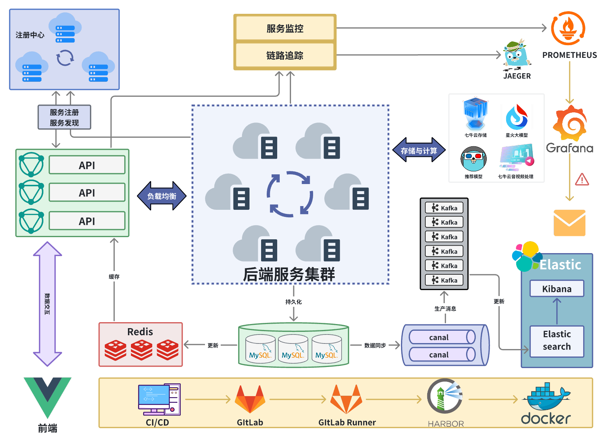
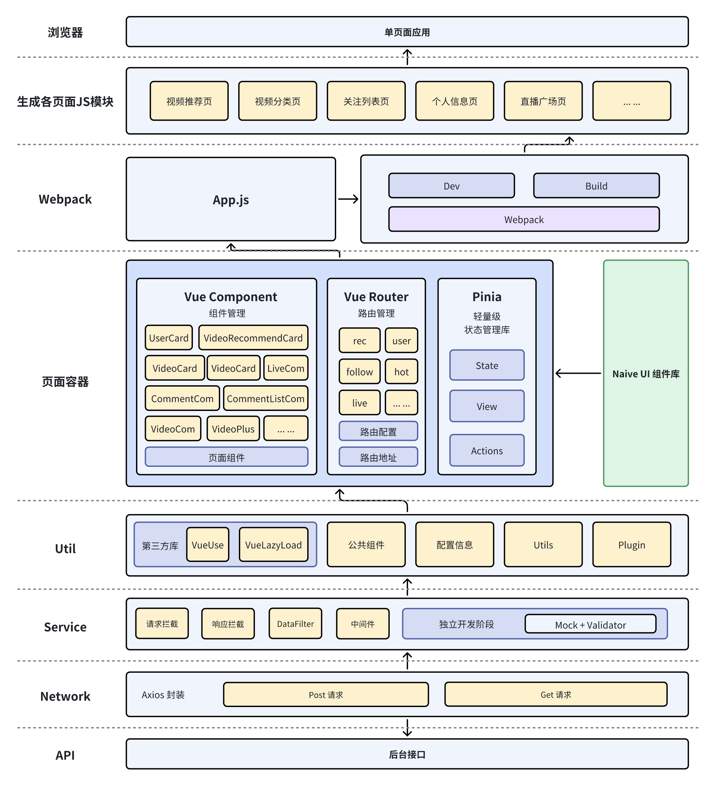
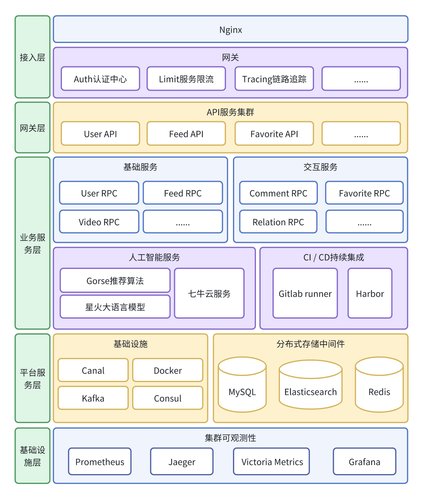

骑上我心爱的小摩托-Scooter
======

# 一、项目介绍

Scooter一个Web端短视频应用，致力于为用户提供交互友好、功能完备的短视频浏览体验和直播体验。
- Scooter集成了Gorse推荐算法，旨在为用户提供更个性化的推荐视频流和更权威的热门视频流。
- Scooter接入星火大模型，通过对视频内容进行语言分析，能够生成视频摘要和标签，实现AI助手自动发布总结评论。
- Scooter接入星火大模型，可以实现舆论检测，从而维护社区和谐。
- 前端使用了Vue3和Ts语言开发，除了点赞、分享、收藏、评论、主页、分类等众多基础功能之外，Scooter还提供了视频弹幕互动、用户直播、带水印视频下载等特色功能，提高了功能的完备性。
- 后端部分使用Go语言微服务框架go-zero，以Gorm作为ORM框架，Consul作为服务的注册和发现，Redis 作为缓存，MySQL进行持久化，同时使用 Elasticsearch 作为搜索引擎，以提供快速而准确的搜索功能。使用Kafka作为消息队列，实现服务之间的解耦和流量削峰。
- 系统可观测性上，Scooter引入 Jaeger 实现链路追踪，能够对请求进行细粒度的跟踪和分析。此外，使用 Prometheus 进行服务监控并接入提供Grafana面板，实现对服务性能和资源的实时监控和可视化展示。
- 目前该项目的弹幕功能仅支持火狐浏览器。

项目详细介绍请看： https://github.com/huangsihao7/scooter-WSVA/blob/main/docs/%E6%9E%B6%E6%9E%84%E8%AE%BE%E8%AE%A1.md

# 二、功能演示

Demo: https://img.peterli.club/scooter/scooter-demo.mp4

# 三、项目分工

| 团队成员 | 主要工作 |
| -------- | -------- | 
| 王银 | 后端架构设计、直播模块、用户模块、关系模块、视频流模块、推荐系统、音视频处理、代码审查|
| 黄思豪  | 评论弹幕模块、点赞模块、搜索业务、DevOps、限流、链路追踪、大语言模型视频分析、缓存设计、舆论风控 、服务监控   |
| 徐宁   |  前端开发，包括前端架构设计、前端业务模块实现等   |

# 四、项目运行说明

为了方便部署，scooter提供了Docker Compose一键部署脚本，下面是通过Docker Compose一键启动Scooter所有服务流程：
1. 安装Docker、docker-compose、显卡驱动、nvidia docker runtime等运行环境
2. 从GitHub上[clone](https://github.com/huangsihao7/scooter-WSVA)项目
3. 切换到docker-compose分支。在项目根目录下运行`docker-compose -f docker-compose-setup.yml up`，这一步的目的是下载前后端依赖包，并编译前后端代码。方便下一步打包docker镜像。
4. 更改项目根目录下的`.env`文件，如`SPARK_APPID`,`OSS_BUCKET`,`LIVE_URL`,`ES_HOST`,`WHISPER_MODEL_PATH`**等**配置文件。确保程序能正常访问七牛云服务和星火大模型等。
5. 在项目根目录下运行`docker-compose -f docker-compose.yml up`，程序会自动下载MySQL、Redis、Gorse、Kafka、ElasticSearch、Consul、prometheus等基础环境，打包前端和后端上一步编译好的文件为Docker镜像，并启动Scooter所有服务

# 五、核心服务

| 服务名 | 作用 |
| -------- | -------- | 
| User 服务 | 提供登录、注册、修改个人信息、上传图片、上传视频和鉴权服务 |
| Relation 服务 | 提供关注、取消关注、粉丝列表、关注列表和朋友列表服务 |
| Feed 服务 | 1. 基于Gorse系统提供视频流服务，包括推荐视频流和热门视频流   2. 提供发布、删除视频服务，用户发布视频时，会将视频信息发送给Event服务   3.提供视频分类、用户作品列表、浏览记录服务   4. 提供相关推荐视频服务   5. 提供视频搜索、历史搜索记录服务   6.提供视频水印生成和下载服务 |
| Comment 服务 | 1. 提供添加评论、删除评论、评论列表和评论数量服务   2. 接入了星火大模型，发布视频时添加视频摘要功能，评论视频时提供舆论检测功能   3.添加评论时，会将评论反馈发送给Gorse推荐系统 |
| Danmu 服务 | 提供添加弹幕、查看视频弹幕、调整弹幕透明度服务 |
| Favorite 服务 | 1. 提供点赞、取消点赞、用户喜欢列表和喜欢数量等服务   2. 提供收藏、取消收藏、用户收藏列表和收藏数量等服务   3. 用户点赞/收藏视频时，会将该点赞/收藏指标反馈发送给Gorse推荐系统 |
| Live 服务 | 提供用户开启直播和查看直播服务 |
| Event 服务 | Event服务的消费者，汇聚多个微服务发过来的信息：  1.接入星火大模型提供视频摘要生成服务   2.接入七牛云提供视频审核服务  3.利用Canal同步数据库的更新信息到Elasticsearch，为用户检索视频提供索引服务 |

# 六、技术架构
## 6.1 总体架构

Scooter前端使用Vue，后端使用go-zero作为微服务框架，包括API层和RPC层。API层与前端交互，提供功能中间件。RPC层实现业务逻辑，使用Consul进行服务注册和发现。存储方面，使用MySQL持久化、Redis作为缓存、Elasticsearch为搜索引擎和Kafka作为消息队列。七牛云提供视频存储和音视频分析。算法支持包括推荐算法和语言大模型。服务可观测性通过链路追踪和服务监控实现，可在Grafana展示。

## 6.2 前端架构图

## 6.3 后端架构图

