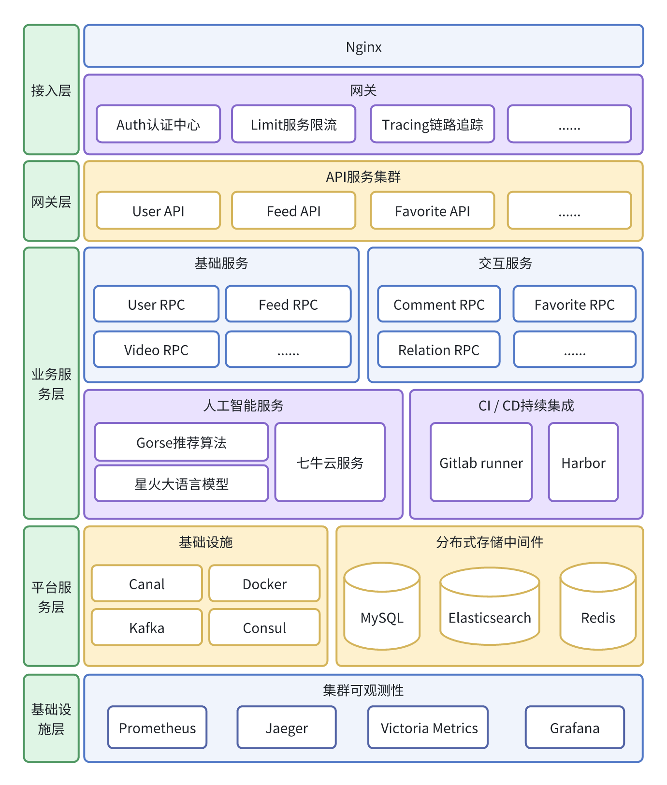
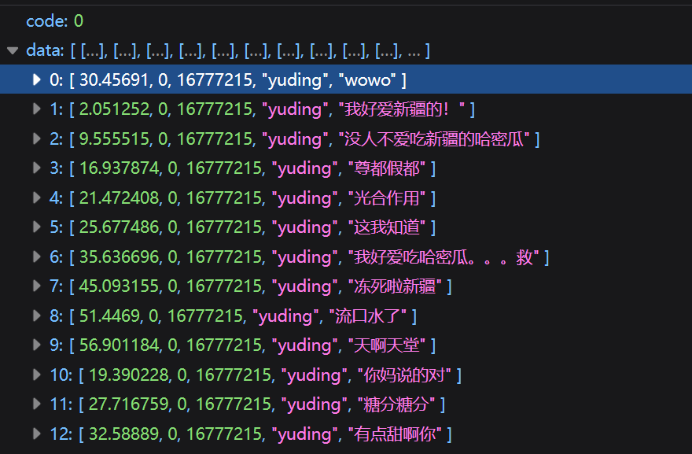
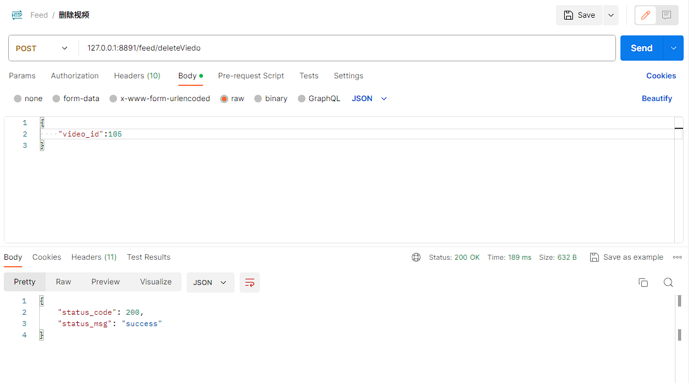
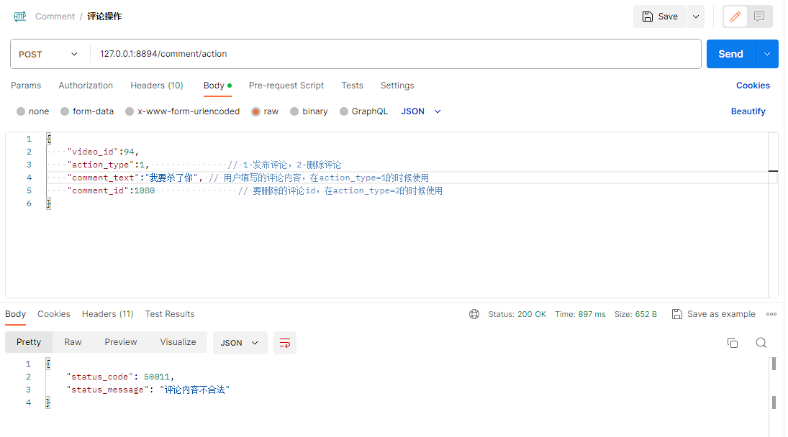

骑上我心爱的小摩托-Scooter
======

# 一、项目介绍

本项目是一个基于Web的短视频应用，名为Scooter，致力于为用户提供友好的短视频浏览和分析体验。Scooter集成了推荐算法，旨在为用户提供更优质的视频观看推荐。同时，我们还整合了语言大模型视频分析功能，能够进行舆论检测，为用户提供更智能的服务。

在前端方面，Scooter采用了Vue框架作为开发工具，实现了弹幕互动、关注和喜欢功能等操作，以增加用户的参与度和互动性。

后端部分使用Go语言微服务框架go-zero，以Consul作为服务的注册和发现。Redis 作为缓存，MySQL进行持久化，同时使用 Elasticsearch 作为搜索引擎，以提供快速而准确的搜索功能。使用Kafka作为消息队列，实现服务之间的解耦和流量削峰。

系统可观测性上，Scooter引入 Jaeger 实现链路追踪，能够对请求进行细粒度的跟踪和分析。此外，使用 Prometheus 进行服务监控并接入提供Grafana面板，实现对服务性能和资源的实时监控和可视化展示。

# 二、功能演示
## 2.1 整体演示

## 2.2 功能模块演示
### 2.2.1 用户登录注册
* 当用户输入登录信息后点击登录按钮，系统将验证其提供手机号和密码。
* 如果用户未注册过，系统将提供一个注册面板，以便用户可以完成注册，随后，用户可以使用其新创建的账户进行登录操作。


### 2.2.2 视频播放、弹幕功能
* 用户可以启动视频、暂停视频以及拖动进度条来满足播放需求，并且可以设置是否循环播放视频。
* 用户可以选择不同的倍速来调整视频的播放速度。
* 用户可以发送弹幕，同时系统也会展示其他用户发送的弹幕。
* 用户可以自定义视频的音量。
* 用户可以切换视频播放器的显示模式，选择小窗播放或全屏播放，以适应不同的浏览和观看需求。


### 2.2.3 直播功能
* 用户可以在顶部导航栏上点击"我要直播"按钮，以获取系统提供的推流地址。用户可以将该推流地址输入到第三方软件（例如：OBS）中，以进行直播操作。
* 在直播页面，用户可以浏览当前正在直播的用户列表，并查看他们十秒内的直播截图。用户可以点击直播截图，进入对应的直播页面观看直播内容。此外，用户还可以点击用户头像，以便查看用户的个人主页。


### 2.2.4 视频发布功能
* 用户可以点击导航栏中的“投稿”按钮进入投稿页面。在该页面，用户可以输入投稿视频的描述，上传视频资源，并选择适合的分类。上传完成后，用户可以点击投稿按钮，完成投稿操作。
* 用户完成投稿后，系统将会将投稿的视频资源上传到七牛云的云端存储，并进行风险审核，以确保投稿内容符合相关规定和准则。
* 我们平台支持用户自主上传内容，这使得我们成为一个用户生成内容（User-generated Content）的平台。这种模式能够提升平台的可用性和可玩性，并且促使用户积极参与，产生丰富多样的内容。

<video src="video/PostVideo.mp4" controls="controls" width="100%"></video>

### 2.2.5 推荐视频与热门视频功能（视频切换逻辑、游客访问限制）
* 系统实现了视频上下滑动观看功能，用户可以通过三种方式进行视频切换：使用键盘上下键、鼠标滚轮或点击右下角的上下按钮。
* 我们为推荐视频流提供了推荐算法，通过分析用户在刷视频过程中的喜好，实时从Gorse推荐系统中获取用户可能感兴趣的视频推荐。同时，系统还会将用户的反馈实时传递给推荐系统，以进一步优化推荐结果。
* 对于已登录用户，他们可以无限滑动浏览视频，并且随着视频的切换，视频评论、相关推荐的内容也会同步切换。
* 对于未登录用户，系统限制了视频的浏览数量为十条。此外，未登录用户无法进行点赞、收藏、评论等操作，从而鼓励用户进行登录，以获得更多功能和个性化的推荐体验。

<video src="video/FeaturedVideosWithPopularVideoFeatures.mp4" controls="controls"  width="100%"></video>

### 2.2.6 视频分类功能
* 用户可以在系统提供的分类导航中选择感兴趣的视频分类，例如娱乐、体育、知识、二次元等。
* 一旦用户选择了特定的分类，系统将会展现该分类下的多条视频内容，使得用户更好地定位和浏览自己喜欢的视频类型。

<video src="video/VideoClassify.mp4" controls="controls" width="100%"></video>

### 2.2.7 视频搜索
* 用户可以通过提交关键词在我们的平台内搜索视频。搜索结果将显示相关视频，并且用户可以通过点击视频封面来观看对应的视频内容。用户还可以点击视频发布者的头像来查看其个人信息。
* 为了方便用户下次搜索，我们将保存用户最近五条的搜索关键词到历史记录中。用户下次想要搜索时，可以直接点击历史记录中的搜索关键词，省去重新输入的步骤。同时，用户也可以清除自己的搜索记录，以便保护隐私或重新开始搜索。

<video src="video/VideoSearch.mp4" controls="controls" width="100%"></video>

### 2.2.8 点赞视频、收藏视频、下载视频带水印功能
* 在视频的右侧互动栏中，用户可以点击点赞按钮来给视频点赞，表示对视频的喜爱和支持。同时，用户还可以点击收藏按钮将视频添加到自己的收藏列表中，以便随时回顾和查看。
* 在个人主页中，用户可以方便地查看自己点赞过和收藏过的视频，这样用户可以快速找到自己感兴趣的视频内容，并进行回顾和互动。
* 在视频的右侧互动栏中，用户可以将平台的视频下载到本地。下载的视频会在左上角添加本平台的视频水印，以标明其来源和版权信息。

<video src="video/InteractiveFunction.mp4" controls="controls" width="100%"></video>

### 2.2.9 评论视频功能，评论风险控制
* 用户可以点击视频右侧互动栏中的评论按钮，即可浏览视频的相关评论。
* 平台使用星火大模型自动生成视频的内容概况，并通过AI小摩托发布这条评论。
* 用户可以在下方的评论输入框中输入评论文字，通过回车键或者点击左侧发送按钮来实时发布评论，也可以删除自己发布的评论。
* 平台还对用户发布的评论进行了风险控制，如果用户的评论出现了敏感词汇，将无法被发布。

<video src="video/ReviewVideo.mp4" controls="controls" width="100%"></video>

### 2.2.10 相关视频推荐和视频分享功能
* 用户可以在展开评论列表后，切换顶部标签来查看从Gorse推荐系统中得到的这条视频相关的视频。
* 如果视频描述过长，用户可以点击描述以查看完整内容，并且可以点击某个视频的封面图片来浏览该条视频。
* 用户可以点击右边的分享按钮给其他用户分享视频

<video src="video/VideoRecommendAndShare.mp4" controls="controls" width="100%"></video>

### 2.2.11 用户信息展示功能（查看发布、点赞、收藏、历史浏览记录）
* 用户可以在“我的”页面中查看自己发布过的作品，点击作品浏览相应的视频内容，并有权限删除自己发布的作品。
* 用户可以通过切换标签页来查看自己点赞过的视频、收藏过的视频以及浏览过的历史记录，以方便地管理和回顾互动和浏览记录。
* 用户可以点击其他用户的头像来查看TA的作品、点赞和收藏列表。
* 用户的历史浏览记录是隐藏的，无法被其他用户查看。

<video src="video/UserInfoDisplay.mp4" controls="controls" width="100%"></video>

### 2.2.12 用户信息修改功能
* 用户可以在“我的”页面中，通过点击用户信息卡片右上角的“编辑资料”按钮来修改自己的个人信息。这些个人信息包括更新头像、背景图片、昵称、简介等内容。

<video src="video/UserInfoEdit.mp4" controls="controls" width="100%"></video>

### 2.2.13 用户关系功能（关注视频作者、关注、粉丝、朋友列表）
* 在视频右侧的互动栏中，用户可以通过点击视频发布人头像下方的黄色按钮来关注或取关该用户。此外，用户还可以点击发布人头像，进入TA的个人主页，然后在个人主页中进行关注或取关操作。
* 在“我的”页面中，用户可以点击关注、粉丝、朋友按钮来方便地查看自己关注的用户、粉丝和朋友列表。
* 在展示的用户列表中，用户可以点击视频封面来浏览某用户最新发布的一条视频，或者点击用户头像查看其个人主页。此外，用户还可以在用户卡片下方的关注/已关注按钮上点击，实现关注或取关操作。
* 此外，用户还可以点击正在查看的用户的关注数量、粉丝数量和朋友数量按钮，以查看该用户所关注的人、粉丝列表和朋友列表等详细信息，从而进一步了解相关用户的关系网络。

<video src="video/UserRelation.mp4" controls="controls" width="100%"></video>

# 三、项目分工

## 3.1 代码分工
| 团队成员 | 主要工作 |
| -------- | -------- | 
| 王银(队长) | 后端架构设计、直播模块、用户模块、关系模块、视频流模块、推荐系统、音视频处理、代码审查|
| 黄思豪  |评论弹幕模块、点赞模块、搜索业务、DevOps、限流、链路追踪、大语言模型视频分析、缓存设计、舆论风控    |
| 徐宁   |   前端开发，包括前端架构设计、前端业务模块实现等   |
## 3.2 项目开发流程

考虑到项目中本身微服务较多且依赖较多基础服务，实际运行时服务总量在25+，如果没有一个自动化代码构建方式的话，仅依靠手动运行，步骤繁琐且不能很好的控制代码质量。

因此scooter使用私有GitLab作为版本控制平台兼CI/CD工具，使用GitLab Runner在每次代码提交时自动进行前后端以及机器学习模块的**编译**、**打包镜像**、**上传到镜像仓库**、**服务器部署**。


### 3.2.1 GitLab 流水线


### 3.2.2 Harbor私有镜像仓库


### 3.2.3 运行服务


## 3.3 项目部署

除了借助GitLab Runner进行持续集成外，如果需要完整在本地运行项目，Scooter还采用Docker Compose进行容器编排，

Docker Compose会根据配置快速完成镜像构建，并使用预先设置的配置进行构建容器运行，方便测试。

### 3.3.1 程序运行说明

为了方便部署，scooter提供了Docker Compose一键部署脚本，下面是通过Docker Compose一键启动Scooter所有服务流程：
1. 安装Docker、docker-compose、显卡驱动、nvidia docker runtime等运行环境
2. 从GitHub上[clone](https://github.com/huangsihao7/scooter-WSVA)项目
3. 在项目根目录下运行`docker-compose -f docker-compose-setup.yml up`，这一步的目的是下载前后端依赖包，并编译前后端代码。方便下一步打包docker镜像。
4. 更改项目根目录下的`.env`文件，如`SPARK_APPID`,`OSS_BUCKET`,`LIVE_URL`,`ES_HOST`,`WHISPER_MODEL_PATH`**等**配置文件。确保程序能正常访问七牛云服务和星火大模型等。
5. 在项目根目录下运行`docker-compose -f docker-compose.yml up`，程序会自动下载MySQL、Redis、Gorse、Kafka、ElasticSearch、Consul、prometheus等基础环境，打包前端和后端上一步编译好的文件为Docker镜像，并启动Scooter所有服务

下图为启动所有服务后docker运行状态：


# 四、项目实现

## 4.1 技术选型
### 4.1.1 前端
* 前端框架：Vue 3
* 路由管理：Vue Router
* 全局状态管理：Vuex
* 状态管理库：Pinia
* 实用工具库：VueUse
* 编程语言：TypeScript
* UI库：Naive UI
* 前端构建工具：Vite
* 网络请求库：Axios
* 部分网络请求方式：XMLHttpRequest
* 模块打包工具：Webpack
* CSS预处理器：SCSS
* 包管理工具：npm
* 版本控制工具：Git

### 4.1.2 后端
* 微服务框架： go-zero
* IDL语言：Protocol Buffers v3
* 数据库： MySQL
* ORM框架：Gorm
* 中间件： Redis、Kafka、Elasticsearch
* 管理面板： Grafana、Jaeger、Kibana
* 服务发现：Consul
* ORM框架：Gorm
* 容器化技术：Docker
* 推荐系统：Gorse
* 大语言模型：讯飞星火
* 音视频处理：七牛云
* 存储服务器：七牛云
* 代理：Nginx
* 数据同步：Canal
* 可观测性：OpenTelemetry、VictoriaMetrics、Prometheus
* CI/CD: GitLab CI，Harbor


## 4.2 结构设计

### 4.2.1 技术架构

Scooter前端使用Vue，后端使用go-zero作为微服务框架，包括API层和RPC层。API层与前端交互，提供功能中间件。RPC层实现业务逻辑，使用Consul进行服务注册和发现。存储方面，使用MySQL持久化、Redis作为缓存、Elasticsearch为搜索引擎和Kafka作为消息队列。七牛云提供视频存储和音视频分析。算法支持包括推荐算法和语言大模型。服务可观测性通过链路追踪和服务监控实现，可在Grafana展示。


### 4.2.2 前端架构图


### 4.2.3 后端架构图




### 4.2.4 数据库ER图


- user 表: 存储用户基本信息，以id为主键，对 mobile 字段建立唯一索引，满足用户登录时手机号码的唯一性。
- videos 表：存储短视频的基本信息，以id为主键。
- relations表：存储用户与用户之间关注与被关注的信息，以id为主键。
- comments表：存储用户对视频的评论信息，以id为主键。
- danmu表：存储每个短视频中，弹幕内容与发送时间，以id为主键。
- favorites表：存储用户与视频之间的点赞关系，以id为主键。
- stars表：存储用户与视频之间的收藏关系，以id为主键。
- label表：存储每个视频对应的标签信息，以id为主键。
- history表：存储用户的浏览记录，以id为主键。

## 4.3 项目特色介绍
### 4.3.1 视频流处理
Scooter 以七牛云为存储服务器，基于Gorse推荐系统给用户推视频。

* 用户在上传视频时，Scooter会先将视频的信息传入七牛云的存储服务器，并触发视频转码生成水印功能，保留带有水印的供用户下载的视频。
* 用户在发布视频时，Scooter将视频的信息传送到 Kafka 消息队列中。后台运行的消费者会订阅这些消息，并调用七牛云的`/v3/video/censor`接口对视频进行审核。
* 审核通过后，Scooter基于Whisper模型进行视频文字提取，通过Whisper模型把视频中的音频转化成文字，并将数据传给星火大模型，生成视频摘要与关键字，后将关键字传入Gorse推荐系统，摘要放入视频评论。
* 用户刷视频时，会根据用户曾留在系统中的反馈，由Gorse推荐系统给用户拉取符合其兴趣的视频，并在用户浏览视频的同时收集反馈，存入Gorse系统。


### 4.3.2 基于大语言模型的视频摘要与关键词提取
Scooter 在用户上传发布视频并通过七牛云审核后，会异步进行视频分析操作，通过科大讯飞星火大模型对对视频进行语音文字提取，并对其分析生成视频摘要与视频关键字，后将视频便签存入Gorse推荐系统，将视频摘要作为评论插入视频的第一条评论中。


视频摘要总结Prompt：
```
您将获得一段视频内容的文本，您的任务是给出2个简体中文句子来总结视频。
下面是视频文本内容:
```
视频关键词提取Prompt：
```
您将获得一段视频内容的文本，您的任务是从下面可选的标签列表中为视频选择5个简体中文标签，以吸引观众。
请直接输出这5个标签，下面是可选的标签的列表:
美食|动漫|游戏|网络小说|科学|编程|文学|化学|计算机|哲学|经济学|政治|法律|艺术|健康|音乐|影视|综艺|直播|明星|搞笑|脱口秀|魔术|舞蹈|相声|运动
下面是视频文本内容:
```
视频摘要及关键词提取实例返回：
```json
{
  "status": 200,
  "message": "success",
  "timestamp": "2023-11-04 14:01:45",
  "data": {
    "keywords": [
      "搞笑",
      "脱口秀"
    ],
    "summary": "1. 专家指出烧节盖烟太黑会污染空气，于是主人公用大塑料袋装起来，展示了聪明的一面。\n2. 主人公用塑料袋装满了烧节盖烟，但面临如何处理的问题，引发了思考。",
    "text": "专家说烧节盖烟太黑了容易污染空气于是我就找了个大塑料袋把烟给装起来了嘿嘿 还是我聪明啊哎呀 还是你小子机灵呢不过你这塑料袋装满了之后扔哪啊这塑料袋小红书",
    "duration": 15.666667
  }
}
```
### 4.3.3 基于语音识别模型的视频文字提取
Scooter基于Whisper模型进行视频文字提取，通过Whisper模型把视频中的音频转化成文字，供视频摘要及关键词提取。
```python
from transformers import WhisperForConditionalGeneration, WhisperProcessor
whisper_processor = WhisperProcessor.from_pretrained(settings.WHISPER_MODEL_PATH)
forced_decoder_ids = whisper_processor.get_decoder_prompt_ids(
    language="chinese", task="transcribe", no_timestamps=False
)
prompt_ids = whisper_processor.get_prompt_ids(
    settings.WHISPER_PROMPT, return_tensors="pt"
).to(settings.DEVICE)
whisper_model = WhisperForConditionalGeneration.from_pretrained(
    settings.WHISPER_MODEL_PATH
).to(settings.DEVICE)
input_features = whisper_processor(
    audio,
    sampling_rate=sampling_rate,
    return_tensors="pt",
).input_features
# generate token ids
predicted_ids = whisper_model.generate(
    input_features.to(settings.DEVICE),
    forced_decoder_ids=forced_decoder_ids,
    prompt_ids=prompt_ids,
)
# decode token ids to text
transcription = whisper_processor.batch_decode(
    predicted_ids, skip_special_tokens=True
)
```
### 4.3.4 智能视频推荐算法

Gorse是一个开源的推荐系统框架，它基于协同过滤和内容过滤技术，通过分析用户行为和物品内容来实现个性化推荐。Gorse推荐模型的推荐流程包括数据准备，数据预处理，特征工程，建立候选集，训练模型，模型评估，推荐生成和实时更新。在这个流程中，我们收集用户行为数据和物品数据，提取有意义的特征，生成候选物品集合，训练推荐模型，并使用评估指标评估模型的效果。当有新的用户请求时，使用训练好的模型和候选集生成个性化推荐结果，并定期或实时更新模型以适应用户和物品的变化。


Scooter 基于 Gorse 推荐系统搭建了自己的视频数据中心，为用户提供智能的视频推荐功能。我们通过大语言模型对视频的语音识别，采集出视频的标签信息。同时，我们采用四个指标来评估用户对视频的喜好程度，分别为用户的已读、点赞、收藏和评论。这些指标根据其重要性进行了权重的设定，以更准确地推荐符合用户兴趣的视频内容。

下图为Scooter系统中视频在Gorse推荐系统中的标签与ID


下图为Scooter系统中视频在Gorse推荐系统中收到的反馈


在Scooter中，我们通过预加载和实时推送视频流的功能来保证用户在刷短视频时的体验。为了观看流畅，用户第一次请求推荐和热门视频时，我们会返回5个视频给用户，并在前端做好预加载，预防使用体验中出现卡顿。为了符合用户兴趣，用户每刷完一个视频，都会给Gorse发送反馈，并根据用户的喜好得到下一个视频的信息。

Scooter 的特点在于，在视频流的推送方面，我们避免向用户推送已经观看过的视频，从而提供更加个性化的推荐体验。每个用户的视频推荐结果都基于其过去的浏览偏好，从而确保推荐内容与用户的兴趣和偏好相匹配。


### 4.3.5 直播
Scooter借助利用七牛云的直播服务和 OBS 软件，为用户提供了一个稳定、高效的直播平台。我们根据用户的id生成其特有的直播推流地址，并借助该推流地址使用OBS软件实现直播推流，并在Scooter的直播频道进行呈现。通过七牛云的直播封面技术，我们规定了其每隔60秒截直播间的照片作为直播封面。


当用户查询直播列表时，将调用七牛云的StreamLists接口，获取正在活跃的直播流，并呈现给用户。

```go=
man := pili.ManagerConfig{
		AccessKey: l.svcCtx.Config.AccessKey,
		SecretKey: l.svcCtx.Config.SecretKey,
		Transport: nil,
	}
	manger := pili.NewManager(man)
	list, err := manger.GetStreamsList(l.ctx, pili.GetStreamListRequest{
		Hub:      "scooter",
		LiveOnly: true,
	})
	if err != nil {
		return nil, err
	}
```

在后台，我们也可以对所有的直播进行实时流量与人数监控。


### 4.3.6 视频弹幕


Scooter引入了弹幕功能，为用户带来了一种新颖而丰富的互动体验。弹幕是一种在视频播放过程中以滚动形式展示的实时评论，用户可以通过输入文本消息，将其以弹幕的形式发送到视频播放界面上。通过弹幕功能，用户可以即时表达自己的想法、评论和互动，与其他观众进行实时交流。这种互动形式不仅增加了用户之间的沟通和参与感，还为用户提供了多样化的观看体验。




### 4.3.7 消息搜索 

搜索功能在后端业务中扮演着至关重要的角色。Scooter能够帮助用户快速查找和过滤数据，提供高效的数据检索，保持实时更新和即时性，满足复杂的查询需求，并最终提升用户体验。无论是处理大量数据还是提供个性化的数据访问，搜索功能都是不可或缺的工具之一。


当用户发布视频信息或语言模型算法为视频生成分类标签时，这些操作会触发对数据库的操作。对于更新或创建操作，会将相应的变更写入数据库的binlog中。为了保证搜索引擎能够获取到最新的数据并提供给用户搜索，我们采用 Elasticsearch 作为存储搜索视频的关键信息的解决方案。

为了实现数据的同步更新，我们引入了canal来监听数据库的 binlog 变化。canal 会将产生的变更消息传递到Kafka消息队列中。然后，我们使用Kafka消费者来消费这些数据，并将其更新到Elasticsearch中。

Scooter 这么设计的优点在于：首先，使用binlog可以捕捉到数据库的每个变更操作，包括更新和创建操作，确保了数据的完整性和一致性。其次，通过使用Kafka 作为中间消息队列，可以实现高效的异步数据传输和解耦。最重要的是，将数据更新到 Elasticsearch 中，使搜索引擎能够及时获取到最新的数据，提供给用户快速而准确的搜索结果。


通过这种实现我们能够保证搜索引擎与数据库之间的数据同步，并提供可靠的搜索功能。无论是用户发布新的视频信息还是语言模型算法生成新的分类标签，都能够迅速反映在搜索引擎中，为用户提供最新、全面的搜索体验。
### 4.3.8 服务解耦和流量削峰

服务解耦和流量削峰是指将一个系统中的服务进行解耦，使其能够独立运行和扩展，并通过一些策略来平衡系统的负载，减少系统的压力和资源消耗。这两个概念的出现是为了应对现代高流量和高并发的网络环境下，系统面临的挑战和需求。


从后端架构设计出发，我们的后端采用Go-Zero框架，它是一个基于Go语言的微服务框架，它提供了一种服务解耦的设计思路和实现方式。通过Go-Zero，我们可以将一个复杂的系统拆分成多个独立的微服务，每个微服务都有自己的职责和功能，并且可以独立部署和扩展。Go-Zero采用了领域驱动设计（DDD）的思想，将业务逻辑划分为多个领域模型，每个领域模型对应一个微服务。这种方式使得不同的团队可以独立开发和维护各个微服务，减少了团队之间的依赖和协调成本。同时，Go-Zero提供了一套完善的服务注册和发现机制，使得各个微服务可以方便地进行通信和协作。

同时，在视频上传层面，通过在用户视频上传路径设置消息队列Kafka，实现了服务解耦和削峰的效果，后面我们会详细介绍这一过程。服务解耦将上传服务和视频处理服务解耦开发，提高了系统的可维护性和可扩展性。削峰则通过异步处理视频任务，避免了服务器过载，确保系统的稳定性和性能。

### 4.3.9 指标监控

服务监控在现代软件开发中具有重要性。它能够实时追踪和监测系统的运行状态、性能指标和异常情况，提供故障排查和预警功能。通过监控，我们能够及时发现和解决系统故障，减少故障修复时间，提高系统的可用性和稳定性。

黄思豪：介绍一下下面的图


其中，Prometheus是一种流行的开源监控系统，它具有灵活的数据模型和强大的查询语言，可以收集、存储和分析各种指标数据。而Grafana是一款可视化工具，能够与Prometheus集成，提供仪表盘和图表展示，使监控数据更加直观和易于理解。通过使用Prometheus和Grafana进行服务监控，我们可以实时了解系统运行状况，发现潜在问题，并及时采取措施，以保障系统的正常运行和优化性能。

### 4.3.10 链路追踪

在Scooter的微服务架构中，由于调用链可能涉及多个环节，例如从HTTP到RPC，再从RPC到HTTP，开发人员通常需要了解每个环节的调用情况和性能。为了实现这一目的，我们采取的方案是全链路跟踪。go-zero集成了强大的链路追踪功能，其实现如下所示：


全链路跟踪的方法是在请求开始时生成一个唯一的Span ID，并随着整个请求链路传递。通过使用这个Span ID，开发人员可以查看整个链路的情况和性能问题，从而更好地分析和优化系统性能。

同时，我们也为go-zero继承ORM框架Gorm，这一环节也接入到了go-zero的链路追踪：
```go
if err := db.Callback().Create().Before("gorm:createBefore").Register("gorm:createBefore:metric:trace", func(db *gorm.DB) {
   ctx := db.Statement.Context
   tracer := trace.TracerFromContext(ctx)
   _, span := tracer.Start(ctx,
      "gorm:create",
      oteltrace.WithSpanKind(oteltrace.SpanKindClient),
   )
   db.InstanceSet("gorm:create_span", span)
}); err != nil {
   return err
}


if err := db.Callback().Create().After("gorm:createAfter").Register("gorm:createAfter:metric:trace", func(db *gorm.DB) {
   v, ok := db.InstanceGet("gorm:create_span")
   if !ok {
      return
   }
   span := v.(oteltrace.Span)
   if db.Statement.Error != nil {
      span.RecordError(db.Statement.Error)
   }
   span.SetAttributes(
      semconv.DBSQLTableKey.String(db.Statement.Table),
      semconv.DBStatementKey.String(db.Statement.SQL.String()),
   )
   span.End()
}); err != nil {
   return err
}
```
上述代码在使用GORM框架时集成Go-Zero链路追踪功能。通过注册两个Hook函数，在数据库创建操作的前后创建和记录跟踪Span，以便监控和分析数据库操作的性能和执行情况。


我们通过将Jaeger链路追踪与Go-Zero框架集成，能够实时监视系统请求和服务调用的链路，从而更好地实时监控、故障排查和性能优化。
### 4.3.11 视频截帧

视频截帧功能使得我们的系统能够截取视频的一帧作为视频封面，提供吸引人的预览图像。为用户呈现有吸引力和信息性的视频内容。这种方式可以增强用户对视频的兴趣和理解，提升用户浏览和选择视频的效率，为用户带来更好的使用体验。


Scooter在上传视频时，我们调用了七牛云的`vframe/jpg`接口截取视频的第一秒画面生成视频的封面，为用户提供更具吸引力和信息性的预览图像。这项功能允许我们从视频中提取并展示最有代表性的画面，以便在视频列表和播放器中展示。通过单帧截取，我们能够捕捉到视频的关键内容，并为用户提供一个直观的视觉引导。


```go
operationManager := storage.NewOperationManager(mac, &cfg)
	fopVframe := fmt.Sprintf("vframe/jpg/offset/1|saveas/%s",
		storage.EncodedEntry(bucket, strings.TrimSuffix(key, filepath.Ext(key))+".jpg"))
	fops := fopVframe
	_, err = operationManager.Pfop(bucket, key, fops, "", "", true)
	if err != nil {
		l.Logger.Error("截帧失败")
		return nil, code.UserUploadVideoError
	}
```

### 4.3.12 视频审核

视频审核功能确保了用户上传的内容符合我们平台所设定的规定标准。通过对视频内容进行审查和筛选，我们能够保证用户只能浏览到合规的、高质量的内容，从而维护了我们平台的信誉和品质。


Scooter在上传视频时，我们将视频的信息传送到 Kafka 消息队列中。后台运行的消费者会订阅这些消息，并调用七牛云的`/v3/video/censor`接口对视频进行审核。如果视频通过审核，系统将保留该视频并进行后续处理；如果视频未通过审核，系统将调用删除视频的 RPC 服务，将其从系统中移除。这个审核流程具有多个优势。首先，通过将视频信息发送到 Kafka，我们实现了异步处理，提高了系统的并发性和响应能力。其次，利用七牛云的审核接口，我们能够自动化地对视频内容进行审核，减轻了人工审核的工作量，并提高了审核的准确性和效率。


### 4.3.13 视频水印和转码
视频转码技术用于将视频文件从一种格式转换为另一种格式。它可以提高视频的兼容性，使其能够在不同的设备和平台上播放。其次，视频转码可以减小文件大小，节省存储空间和带宽。我们能够对上传的音频文件进行高效的 mp4 转码，并在上传视频文件时自动触发。

视频水印是在视频中嵌入的可识别标识，用于保护内容的版权和来源。视频水印可以防止未经授权的盗版和侵权行为，提高内容的安全性和保护版权。视频水印还可以加强品牌宣传。此外，视频水印还可以提供溯源功能，追踪视频的传播路径和使用情况。

Scooter在上传视频时，会进行视频转码并异步生成带水印的视频。在用户上传视频后，系统会调用七牛云的接口异步生成一份带有我们团队logo的水印视频。这种异步生成的方式不会对用户的上传体验造成延迟，保证了系统的高效性和响应性。通过异步生成水印视频，我们能够充分利用七牛云的强大处理能力，提供快速且高质量的水印视频生成。用户无需等待水印处理完成，即可继续进行其他操作，提高了用户上传的效率和流畅度。
```go
putPolicy := storage.PutPolicy{
		Scope:               bucket,
		PersistentOps:       "avthumb/mp4/wmImage/aHR0cDovL3MzZWplbjBnMi5oZC1ia3QuY2xvdWRkbi5jb20vbG9nLnBuZw==/wmGravity/NorthWest|saveas/" + saceas,
		PersistentNotifyURL: "http://fake.com/qiniu/notify",
	}
```

#### 不带水印的原视频


#### 带水印的下载视频


### 4.3.14 缓存机制
针对Redis中存储的作品数和评论数字段，鉴于读多写少的情况，采用Cache Aside策略是最适合的方法。这种策略的操作步骤是先更新数据库，然后再删除相应的缓存。这种缓存策略的执行过程如下：


写策略的步骤：首先更新数据库中的数据，然后删除缓存中相应的数据。
读策略的步骤：如果所需数据已经缓存在内存中，则直接返回缓存中的数据；如果所需数据未缓存，则从数据库中获取数据，将其写入缓存，并将数据返回给用户。
缓存可以将经常访问的数据存储在快速访问的介质中（Redis数据库），以实现快速的数据检索和返回，从而显著提高性能和响应速度。同时可以减轻后端数据库的负载，将大量的访问请求转移到缓存中处理，从而降低了后端数据处理的压力。


### 4.3.15 评论风控

评论风控技术用于管理和筛选评论内容，旨在防止恶意、不当或违规评论的出现。评论风控可以维护平台的社区秩序，防止恶意攻击、辱骂和仇恨言论的传播，保护用户的安全感和良好的交流环境。其次，评论风控可以过滤垃圾评论和广告信息，提升内容质量和用户体验。此外，评论风控还可以识别和屏蔽敏感信息，保护个人隐私和数据安全。最重要的是，评论风控技术可以快速响应和处理违规评论，减轻人工审核的负担。


Scooter在用户发出评论的同时，会对评论进行分析和判断，以确定是否允许其发布到平台上。该接口的目标是过滤和防止不当、恶意或违规的评论内容出现，从而维护平台的秩序和用户的良好体验。Scooter的评论风控依托于强大的机器学习和自然语言处理技术，通过对评论文本进行深度分析和模式识别，从中提取出关键信息和特征。这些特征包括敏感词汇、恶意行为模式、情感倾向等，用于评估评论的风险程度。

以下是评论风控输入星火大模型的Prompt：
```
您将获得一段文本，您的任务是判断文本的情感倾向，正向文本请返回正向，负向文本请返回负向。
请直接输出情感倾向；
下面是文本内容:
```

### 4.3.16 错误码设计


Scooter采用了一种统一的方式来处理返回的 HTTP 状态码，始终返回 200 OK。而业务错误和服务内部错误则通过自定义的错误码来进行区分。同时，我们保持了 API 服务和 RPC 服务之间的业务错误码的一致性。如果在 RPC 服务中定义了一个业务错误码，它可以透传到 API 服务，并最终通过接口返回给客户端。


当发生错误时，Scooter仍然会返回 JSON 格式的数据，其中 code 字段表示业务自定义的错误码，message 字段提供了详细的描述信息。客户端在接收到这些数据后，可以根据业务错误码进行逻辑处理，并可以将 message 信息用于错误弹窗显示。

在上图所示的流程中，业务 API 和服务 RPC 之间包含两个拦截器。靠近 RPC 的是服务端拦截器，其功能是将业务自定义的错误转换为 gRPC 错误，并将详细的错误信息封装在消息体的 detail 字段中。然后，客户端拦截器从 gRPC 错误中提取消息体的 detail，将其中的错误信息转换为业务自定义的错误码，并返回自定义的错误响应。这样便实现了将业务自定义错误码在服务端和客户端之间进行转换的机制。

在RPC服务中，当我们遇到数据库查询错误或者其他意料之外的错误时，我们可以在RPC里面直接返回错误，交给API层处理。
```go
isFavorite, err := l.svcCtx.FavorModel.IsFavorite(l.ctx, userId, videoId)
if err != nil && err != gorm.ErrRecordNotFound {
return nil, err
}
if isFavorite == false {
logx.Infof("删除的记录不存在")
return nil, code.FavoriteServiceCancelError
}
```
通过以上RPC的代码看出，第一个错误属于数据库的内部错误，第二删除记录不存在属于Scooter预料之内的错误，我们都可以直接返回error给API层。

同时，Scooter可以自定义一些错误码，当遇到意料之内的错误，比如不能够重复点赞，RPC层可以根据自定义错误码将错误返回给API层。

```go
var (
	FavoriteUserIdEmptyError       = xcode.New(30001, "点赞用户id为空")
	FavoriteVideoIdEmptyError      = xcode.New(30002, "点赞视频id为空")
	FavoriteServiceDuplicateError  = xcode.New(30003, "不能重复点赞")
	FavoriteServiceCancelError     = xcode.New(30004, "点赞记录不存在,无法取消点赞")
	FavoriteInvalidActionTypeError = xcode.New(30005, "无效的点赞操作")
	FavoriteLimitError             = xcode.New(30006, "点赞频繁，请稍后再试！")
)
```

当RPC的错误返回到API层，API层的错误处理就会变得很简单。我们在API层自定义了错误处理函数。

```go
func SetErrorHandler(handler func(error) (int, any)) {
	errorLock.Lock()
	defer errorLock.Unlock()
	errorHandler = func(_ context.Context, err error) (int, any) {
		return handler(err)
	}
}
```
API层处理RPC服务的错误:
```go
r, err := l.svcCtx.Favor.FavoriteAction(l.ctx, &favorite.FavoriteActionRequest{
    UserId:     userId,
    VideoId:    req.VideoId,
    ActionType: req.ActionType,
})
if err != nil {
    return nil, err
}
```

有了自定义错误处理函数，Scooter可以始终让前端接收到HTTP 状态码，始终返回 200 OK的信息。


通过这种方式，Scooter实现了简洁、明确的错误处理机制，并同时保持了错误码在 API 服务和 RPC 服务之间的一致性。这样，客户端可以根据返回的数据准确地处理业务逻辑，并根据需要展示错误信息给用户。
### 4.3.17 服务限流
为了防止用户的恶意行为，Scooter会在业务层的rpc中添加限流功能。业务限流的目的是在喜欢点赞、视频发表、关注用户等业务场景上限制用户的操作频率，防止刷评刷赞等行为。

具体实现采用了基于Redis的令牌桶算法。每个用户在每个业务上每秒钟只允许执行3次操作。当用户发送请求时，系统会从Redis中获取一个令牌，如果成功获取到令牌，表示用户未超过限制，请求将被处理；否则，说明用户的操作频率超过了限制，系统将拒绝此次访问。

```go
limiter := redis_rate.NewLimiter(l.svcCtx.RedisClient)
	limiterKey := strconv.FormatInt(userId, 10) + FavoriteLimitKey
	limiterRes, err := limiter.Allow(l.ctx, limiterKey, redis_rate.PerSecond(FavorActionMaxQPS))
	if err != nil {
		l.Logger.Errorf("[favorite limiter] err ", err)
	}
	if limiterRes.Allowed == 0 {
		l.Logger.Errorf("[favorite limiter] err ", err)
		return nil, code.FavoriteLimitError
	}
```

### 4.3.18 Mock模拟数据
Mock模拟数据使得开发和测试团队能够并行工作，而无需等待真实数据的准备。开发人员可以使用模拟数据来构建和调试前端或后端功能，而测试人员可以使用模拟数据进行测试用例的编写和执行，从而实现快速构建原型和演示版本，加快开发迭代的速度。

在Scooter开发阶段，我们充分利用`vite-plugin-mock`插件，通过自定义数据模板以生成随机化数据，并且通过接口请求的方式注入到前端应用程序中。在开发过程中，前端通过接口请求获取模拟数据，模拟实际接口的返回结果，从而在前端开发过程中能够独立高效地进行工作。


```typescript
// 使用自定义数据模板生成随机化User对象数据
const mockUser = mock({
    "avatar": avatar,
    "favorite_count|1-100": 1,
    "follow_count|1-100": 1,
    "follower_count|1-100": 1,
    "friend_count|1-100": 1,
    "gender|0-1": 1,
    "id|1-1000": 1,
    "is_follow|1": true,
    "name": Random.name(),
    "signature": Random.sentence(),
    "total_favorited|1-100": 1,
    "work_count|1-10": 1,
});

// 通过接口请求的方式注入数据
export default [
    {
        url: "/user/login", // 模拟登录的链接
        method: "post", // 请求方式
        timeout: 3000, // 超时时间
        statusCode: 200, // 返回的http状态码
        response: { // 返回的结果集
                status_code: 200,
                status_message: '登录成功',
                user: mockUser
        },
    },
    ...
]
```

下图展示了Mock返回的随机化User对象数据


下图展示了利用Mock随机数据生成的页面内容。


### 4.3.19 节流与懒加载
节流是一种限制函数执行频率的技术，在指定的时间间隔内，控制函数被调用的次数。它可以确保函数在一定时间内只执行一次，避免函数被频繁调用，从而减少不必要的计算、网络请求或事件处理。

由于过于频繁的触发可能会导致不良的用户体验和资源浪费，我们采用throttling来限制视频预加载和发表评论的函数操作，确保请求函数在一定时间间隔内只被触发一次，以避免在短时间内多次发送请求。
``` typescript
// 节流函数
const throttledUpdatePage = throttle(doCommentApi, 500);
// 发布评论
const postComment = (e: any) => {
  if (e.keyCode == 13 && addComment.value) {
    throttledDoComment()
  }
};
```
懒加载是一种网页优化技术，用于延迟加载网页上的一些资源，如图片、视频或其他媒体文件。它的主要目的是提高网页的加载速度和性能，从而改善用户体验。对于包含大量媒体内容的分类视频页面，懒加载可以加快初始页面加载速度，减少带宽消耗，优化网页性能。

由于各个分类的视频页面包含大量媒体内容，我们将各个分类视频的图片通过懒加载载入，加快初始页面加载速度。我们通过LazyLoad来具体实现，将图片标记为懒加载，并且监听滚动事件，判断图片是否进入可视区域，当图片进入可视区域时，触发加载图片的操作，代码如下：
```typescript

```

## 4.4 项目安全性
### 4.4.1 鉴权中间件

鉴权中间件用于在网络通信中验证用户身份和授权访问权限，确保系统安全性和数据保护。它可以进行细粒度的权限管理，根据用户角色和权限设置访问限制，确保敏感数据和功能仅对授权用户可用。此外，鉴权中间件能够减轻开发人员的负担，提供了统一的鉴权逻辑，简化了系统开发和维护。


在Scooter架构中，我们采用了 Go-Zero 集成的 JWT 鉴权中间件，以确保对受限资源的访问仅限于经过身份验证的用户。JWT 是一种基于标准的、轻量级的身份验证和授权机制，通过这一机制，我们能够安全地传输用户的身份信息，并有效地保护我们的 API 端点。Scooter中，没有经过认证的用户只能进行基本操作，如注册、登录和刷视频等。这些操作允许用户浏览和体验系统的基本功能。然而，对于涉及敏感资源或需要身份验证的操作，如点赞、评论、收藏等，只有经过身份验证的用户才能执行。


### 4.4.2 预防 SQL 注入
SQL 注入是一种常见的网络安全漏洞，它允许攻击者通过在应用程序的输入字段中插入恶意的 SQL 代码来执行未经授权的数据库操作。当应用程序没有正确验证、过滤或转义用户输入时，攻击者可以利用这个漏洞来执行各种恶意操作，从而造成数据泄露、数据篡改、未经授权的访问、应用程序崩溃和服务器攻击等危害。

在我们的项目中，前端在用户输入数据之前进行基本的输入验证和过滤，以确保输入数据符合预期的格式。此外，我们对输入框限制输入长度，虽然输入长度限制本身并不能完全阻止 SQL 注入，但它可以起到一定的防御作用，并增加攻击者成功注入恶意代码的难度。

徐宁： 举个例子

### 4.2.3 密码加密

Scooter使用了 scrypt 加密函数。scrypt 是一种密码学哈希函数，由 Go 语言官方维护，用于将密码转换为安全的密钥。该函数具有较高的计算成本，可以有效防御密码破解攻击。它使用大量的内存和计算资源，使得暴力破解需要耗费大量时间和计算能力，提高了密码的安全性。

以下是明文加密的例子：
```
明文：passwd
密文：6741704dc2c8a95cd53a0a7cdae30714b0907ee7695fbaae92f9dd9b9f13e87c
```
```go=
func PasswordEncrypt(salt, password string) string {
	dk, _ := scrypt.Key([]byte(password), []byte(salt), 32768, 8, 1, 32)
	return fmt.Sprintf("%x", string(dk))
}
```


# 五、项目测试
## 5.1 项目结构

### 5.1.1 前端
```
src
├── App.vue // 入口
├── apis
│   ├── comment.ts              // 评论接口
│   ├── favourite.ts            // 喜欢操作接口
│   ├── follow.ts               // 关注操作接口
│   ├── interface.ts            // 数据结构
│   ├── live.ts                 // 直播接口
│   ├── login.ts                // 登录接口
│   ├── user.ts                 // 用户接口
│   └── video.ts                // 视频接口
├── assets
│   ├── base.css                //基础样式
│   ├── iconfont
│   ├── icons
│   └── vue.svg
├── axios
│   └── index.ts                // axios请求配置
├── components
│   ├── cards                   // 卡片组件
│   ├── comment                 // 评论组件
│   ├── live                    // 直播组件
│   ├── menu                    // 导航栏组件
│   ├── myinfo                  // 用户信息组件
│   └── video                   // 视频组件
├── main.ts
├── mock
│   └── index.ts                // 数据模拟
├── router
│   └── index.ts                // 路由设置
├── stores
│   ├── historySearch.ts        // 搜索历史记录缓存（持久）
│   ├── relation.ts             // 关系缓存
│   ├── live.ts                 // 直播缓存
│   ├── route.ts                // 路由缓存
│   ├── user.ts                 // 用户信息缓存（持久）
│   └── video.ts                // 视频缓存
├── style.css
├── test
├── theme.ts
├── tree.md
├── utils
├── view
│   ├── ClassifiedView.vue      // 各个分类页面
│   ├── FollowView.vue          // 关注页面
│   ├── HomeView.vue            // 首页（推荐页面）
│   ├── HotView.vue             // 热门视频页面
│   ├── LiveSquareView.vue      // 直播广场页面
│   ├── LiveView.vue            // 某个直播的视频页面
│   ├── UserView.vue            // 我的页面
│   └── VideoView.vue           // 查看某个视频页面
└── vite-env.d.ts
```
### 5.1.2 后端模块
```
.
├── Makefile                   //编译文件
├── comment                    //评论模块
│   ├── api                    //评论模块api层
│   │   ├── etc                
│   │   └── internal           
│   ├── code                   //错误码
│   ├── gmodel                 //评论model层
│   └── rpc                    //评论模块rpc层
│       ├── etc                
│       └── internal           
├── common                     //公共组件
├── deployments                //部署文件
├── favorite                   //互动模块
│   ├── api                    //互动模块api层
│   │   ├── etc                
│   │   └── internal           
│   ├── code                   //错误码
│   ├── gmodel                 //互动model层
│   └── rpc                    //互动模块rpc层
│       ├── etc                
│       └── internal           
├── feed                        视频模块
│   ├── api                    //视频模块api层
│   │   ├── etc                
│   │   └── internal           
│   ├── code                   //错误码
│   ├── gmodel                 //视频model层
│   └── rpc                    //视频模块rpc层
│       ├── etc                
│       └── internal           
├── kq                         //kafka
│   ├── config.go              //kafka配置
│   ├── pusher.go              //生产者
│   └── queue.go               //队列
├── label                      //标签模块
│   ├── gmodel                 //标签model层
│   └── rpc                    //变迁模块rpc层
│       ├── etc                
│       └── internal 
├── live                       //直播模块
│   ├── api                    //直播模块api层
│   │   ├── etc
│   │   ├── internal
│   └── rpc                    //直播模块rpc层
│       ├── etc                
│       └── internal 
├── mq                         //消费者
│  ├── etc                
│  └── internal 
├── pkg
│   ├── es
│   │   ├── es.go
│   │   └── metric.go
│   ├── interceptors
│   │   ├── client.go
│   │   └── server.go
│   ├── orm
│   │   ├── metric.go
│   │   ├── orm.go
│   │   └── plugin.go
│   └── xcode
│       ├── common.xcode.go
│       ├── response.go
│       ├── status.go
│       ├── types
│       │   ├── status.pb.go
│       │   └── status.proto
│       └── xcode.go
├── relation                   //关系模块
│   ├── api                    //关系模块api层
│   │   ├── etc                
│       └── internal 
│   ├── code                   //错误码
│   ├── gmodel                 //关系模块model层
│   └── rpc                    //关系模块rpc层
│       ├── etc                
│       └── internal 
└── user                       //用户模块
    ├── api                    //用户模块api层
    │   ├── etc
    │   └── internal
    ├── code                   //错误码
    ├── gmodel                 //用户模块model层
    └── rpc                    //用户模块rpc层
        ├── etc
        └── internal
```
### 5.1.3 机器学习模块
```
├── Dockerfile                    // docker打包镜像配置文件
├── app
│   ├── __init__.py
│   ├── api
│   │   ├── apis.py               // 系统API层
│   │   └── endpoints
│   │       ├── __init__.py
│   │       └── speech.py         // 语音相关API层
│   ├── core
│   │   ├── __init__.py
│   │   ├── config.py             // 机器学习配置文件
│   │   ├── logging.py            // 日志组件
│   │   └── response.py
│   ├── models
│   │   └── speech.py             // 封装语音识别模型
│   └── utils
│       └── sparkapi.py           // 封装星火大模型接口
├── main.py                       // 主函数
├── mypy.ini                      // python类型检查配置文件
├── requirements-dev.txt          // 开发环境所需依赖
├── requirements.txt              // 运行依赖
└── scripts
    └── lint.sh                   // 代码格式化及类型检查脚本
```
## 5.2 功能测试
### 5.2.1 用户接口
#### 用户注册
- 注册-成功
  

- 注册-失败（手机号已经被注册）
  

#### 用户登录
- 登录-成功
  

- 登录-失败（用户名或密码错误）
  

#### 编辑个人信息
- 编辑-成功
  

#### 上传文件
- 上传图片-成功
  

- 上传视频-成功
  

### 5.2.2 视频接口
#### 推荐视频流
- 推荐视频（未登录）
  

- 推荐视频（已登录）
  

- 热门视频-成功
  

- 相关推荐视频-成功
  

#### AI分析接口
- 视频关键字提取及摘要总结-成功
  

#### 视频操作
- 发布视频-成功
  

- 删除视频-成功
  

- 查询视频-成功
  

- 视频分类详情-成功
  

- 查询用户作品-成功
  

- 查询用户浏览记录-成功
  

- 视频搜索-成功
  

### 5.2.3 直播接口
#### 开始直播


#### 直播列表


### 5.2.4 互动接口
#### 评论操作
- 评论操作-成功
  

- 删除评论操作-成功
  

- 评论操作-失败（video_id 不存在）
  

- 评论操作-失败（action_type 错误）
  

- 评论操作-失败（内容不合法）
  

- 删除评论操作-失败（video_id 不存在）
  

- 删除评论操作-失败（comment_id 不存在）
  

#### 评论列表
- 评论列表-成功
  

- 评论列表-失败（video_id不存在）
  

#### 弹幕操作
- 发送弹幕-成功
  

- 弹幕列表-成功
  

#### 点赞操作
- 点赞操作-成功
  

- 取消点赞操作-成功
  

- 点赞操作-失败（不能重复点赞）
  

- 取消点赞操作-失败（点赞信息不存在）
  

- 点赞列表-成功
  

#### 收藏操作
- 收藏操作-成功
  

- 取消收藏操作-成功
  

- 收藏操作-失败（不能重复收藏）
  

- 取消收藏操作-失败
  

- 收藏列表-成功
  

### 5.2.5 社交接口
#### 关注操作
- 关注操作-成功
  

- 取消关注操作-成功
  

- 取消关注操作-失败（不能关注自己）
  

- 关注操作-失败（不能关注已关注的人）
  

- 取消关注操作-失败（不能取关未关注的人）
  

#### 关系列表
- 关注列表-成功
  

- 粉丝列表-成功
  

- 好友列表-成功
  
